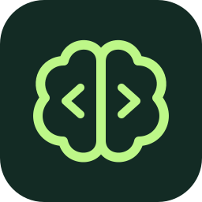

# Learning

**You build. AI writes.**

A Claude Code plugin that puts learning first and keeps you in control while AI writes the code you designed. Claude **asks for your approach first**, helps you examine tradeoffs, and explains unfamiliar concepts. You shape the design and decide when it's ready to implement. Claude writes the code, then explains what it changed and why.

For anyone who wants to learn as they build—whether you're an aspiring engineer, a junior developer, or an experienced engineer exploring an unfamiliar stack. Practice planning how the pieces fit together, anticipating failures, and checking the result while keeping ownership of the decisions.

## One setup per project

How you want to learn depends on what you're learning. The first time you run
`/learning:learn` in a project, it asks how you want to learn there and writes your
answers to `.learning/teaching.md`:

- **Learning loop.** *Design first*: you plan and approve, Claude writes the code and
  explains it. *Practice first*: Claude explains, you write a small exercise, Claude
  reviews it. *Read first*: you explain real code, then change it together. If none
  fits, Claude drafts a custom loop for you to adjust.
- **Style.** How to explain (example, concept or diagram first), how often to stop,
  open-ended or multiple-choice questions, and who writes the code.
- **Support.** What helps when you're stuck, which terms get explained, and when to
  quiz you.

The core rules are the same in every project: you make the design decisions, and
Claude writes code only after you approve that step. You can edit `teaching.md`
yourself or ask Claude to change it. Claude follows a `teaching.md` only after you
approve its exact content, so a repository you clone can't bring its own.

HTML explanations get hover tooltips for terms and syntax. Each term is explained on
at most 3 pages, tracked in `.learning/terms.json`, then joins spaced-repetition
quizzes (when your Quizzes setting allows them): a right answer schedules the next
one in 1, 3, 7, 21, then 60 days; a miss resets it to 1 day.

## Learning On or Off

Choose independently for each project:

| Mode | Command | Behavior |
| --- | --- | --- |
| On | `/learning:learn` or `/learning:learn on` | Follow the full saved learning process. |
| Off | `/learning:off` or `/learning:learn off` | Do the requested work with normal development behavior. |

`/learning:learn status` reports the current mode without changing it. You can
also say "turn learning off" or "turn learning on" in a learning conversation.
Switching needs no extra confirmation and takes effect immediately.

Off suspends all learning checkpoints, implementation approval gates, teaching
style, explainer requirements, term tooltips, quizzes and progress tracking. The
session hook emits no learning instructions, guides or notes while Off. Ordinary
project instructions and tool permissions still apply. A build request or
explanation doesn't turn learning back on.

The mode persists through restarts, resume, compaction and forks. Learning notes,
setup answers and teaching-file approvals are kept for when you turn it on again.
An older `Learning mode: paused` marker also means Off. Newly installed projects
start Off until you explicitly invoke Learn.

Earlier messages stay in an existing chat. Start a fresh chat while Off to keep
previously loaded learning guides and notes out of its context entirely. The
installed commands remain available so you can turn learning on again.

## Get started

You need [Claude Code](https://code.claude.com/docs/en/setup) and
[Python 3](https://www.python.org/downloads/). The plugin uses Python to restore
learning context, record which `teaching.md` files you approved, and reset learning
notes. No extra Python packages are needed.

Clone this repository, then run these commands **one at a time** in Claude Code.
First, add your clone as a marketplace:

```text
/plugin marketplace add /path/to/your/clone
```

After it finishes, install the plugin:

```text
/plugin install learning@learning
```

Restart Claude Code in the project you want to work on, then run:

```text
/learning:learn
```

Setup takes about seven screens, with up to four questions on each. Use the arrow keys and Enter for choices, and say “skip” to take the defaults for anything left. At the end you see your `teaching.md` and choose **Save** or **Change something**. Then ask Claude to build something. For an existing repository, Claude first inspects the code and sketches a small system map.

## What it feels like

You're building a Notion-style notes app: users sign in, create and edit private
notes, and organize them into folders. Here, you're working through how notes and
folders relate—and what should happen when someone deletes a folder.

This condensed example is adapted from a real learning session and uses the
*Design first* loop. Later implementation steps are illustrative; intervening
design discussions are omitted.

**You:**

```text
A note can be in several folders. Deleting a folder should delete its notes.
```

**Claude:**

```text
✦ Build checkpoint: Deleting a shared note

"Trip ideas" is in both Travel and Summer. Deleting it removes it from both.

When someone deletes Travel, what should happen to that note in Summer?
```

**You:**

```text
Keep it in Summer. If it has no folders left, keep the note outside any folder.
```

**Claude:**

```text
That separates deleting a folder from deleting a note.

✦ Build checkpoint: Connecting notes and folders

How would you represent which folders a note belongs to, without copying the note?
```

**You:**

```text
A links table with note_id and folder_id. Deleting a folder removes its links,
not the notes.
```

**Claude:**

```text
Each link records one membership. Several links can point to the same note;
a note with no links is unfiled.

notes ← folder links → folders

✦ Design checkpoint: Folder membership

Proposed: store notes once and track folder membership in a links table.
Deleting a folder removes its links and keeps the notes. This supports multiple
folders per note; loading a folder's notes needs a lookup through those links.

Confirming records this design. We still need to work through access rules
and technology choices before writing code.

❯ 1. Confirm and continue
     This approach makes sense to me; move to the next piece.
  2. Discuss
     Ask questions or clarify anything that doesn't make sense before deciding.
```

**You:**

```text
Confirm and continue.
```

*Later, after the remaining choices for this step are worked through...*

**Claude:**

```text
✦ Implementation checkpoint: Folder membership

I'll add the agreed tables and folder-deletion operation, then test that deleting
a folder preserves its notes and their membership in other folders.
This step builds storage behavior; the UI comes later.

❯ 1. Implement this step
     This approach makes sense to me; write the code for this step.
  2. Discuss
     Ask questions or clarify anything that doesn't make sense before deciding.
```

**You:**

```text
Implement this step.
```

*Claude writes the code and runs the tests.*

**Claude:**

```text
✦ Implementation report: Folder membership

- Added the schema migration: each membership references one note and one folder.
- Added folder deletion: removes the folder and its links, preserving note content.
- Added and ran tests for shared notes and notes left without a folder; both passed.
```

You don't need to know the answer already. Claude can explain unfamiliar concepts, sketch the relevant pieces, and help you tackle a smaller question. You stay involved in forming the plan. Answer in plain English; ask for more help or say “skip” whenever you want.

In the Design first loop, describing what you want sets the requirements. Build
Checkpoints ask you to work out how it should function; a feature preference
doesn't approve an architecture.

| Checkpoint | What happens |
| --- | --- |
| **Build** | You reason through how to approach the problem with Claude. |
| **Design** | Review the design. **Confirm and continue** records it and continues planning; no code yet. |
| **Implementation** | Review the specific code changes. **Implement this step** authorizes Claude to make them. |

These aren't three mandatory stops. When ready to code, the Implementation
checkpoint also confirms the design, skipping a separate Design checkpoint.
Both confirmations offer **Discuss** to ask questions, clarify anything confusing,
or explore alternatives before deciding.

When Claude proposes additional implementation details, it separates them from your
decisions in a short list or table explaining each addition and why it matters.
You can question or change any item before proceeding.

After implementation, Claude briefly explains what changed, how the key code works,
why it fits your decision, any tests it added or updated and what they cover, and
which checks ran with their results. Ask to dig deeper anywhere it's unclear.

Small diagrams help you trace data, understand relationships, and see how the system fits together.

## Make it yours

Experience changes the support you get, not your ownership of decisions:

| Level | Teaching approach |
| --- | --- |
| Beginner | Explain unfamiliar pieces, use diagrams, ask smaller reasoning questions. |
| Intermediate | Less introductory context; explore interactions and tradeoffs. |
| Advanced | Probe difficult constraints, failure modes, and design assumptions. |

Everyone reasons first. Claude adapts to what you demonstrate and how familiar you
are with the stack. How often Claude stops (Light, Normal or Frequent) is a separate
setting in `teaching.md`. To change any setting, say so; Claude shows the change
and asks you to save it before editing `teaching.md`.

- “Switch to Practice first.”
- “Use fewer checkpoints.”
- “Focus on backend architecture.”
- “Use multiple-choice questions.”
- “Just implement this one.”
- “Turn learning off.” Resume with `/learning:learn`. “Pause learning” also turns it Off.

Your `teaching.md`, learning notes, and a project map live in `.learning/` in your project. Projects set up with an older version keep their `.vibe-wise/` or `.sensible-vibes/` folder; the first session after updating (or `/learning:learn`) walks you through setup rounds 3–6, with your old answers pre-selected. Learning mode resumes in future sessions and after compaction. Add `.learning/` to your `.gitignore` to keep your notes out of Git; the plugin won't change it silently.

No extra account, backend, or telemetry. Saved notes are included in Claude's context, so your normal Claude Code data settings still apply. Approvals of `teaching.md` files are kept outside your projects in `~/.config/learning/approved.json` (or `$XDG_CONFIG_HOME/learning/`); delete an entry to make Claude ask again.

To start learning this project from scratch, run `/learning:reset`. It shows the
project and asks **Cancel / Reset learning**. After confirmation, it backs up your
profile, progress, project map, and `teaching.md` inside the notes directory's
`backups/` folder, then starts setup again. Source code and other projects stay
untouched. To change your experience level or how you're taught, just tell Claude;
no reset is needed.

## Updating

After pulling new changes into your clone, run these in your terminal:

```sh
claude plugin marketplace update learning
claude plugin update learning@learning
```

Then restart Claude Code. Your project learning notes stay intact; no reset is needed.
Projects set up before 0.2.0 go through setup rounds 3–6 once, in their first session
after the update.
Run `claude plugin list` to check the installed version.
[More about plugin updates](https://code.claude.com/docs/en/discover-plugins#keep-plugins-updated).

## License

[MIT](LICENSE). You can use, modify, and share this software, including commercially. Keep the license notice with copies. The software comes without a warranty.
